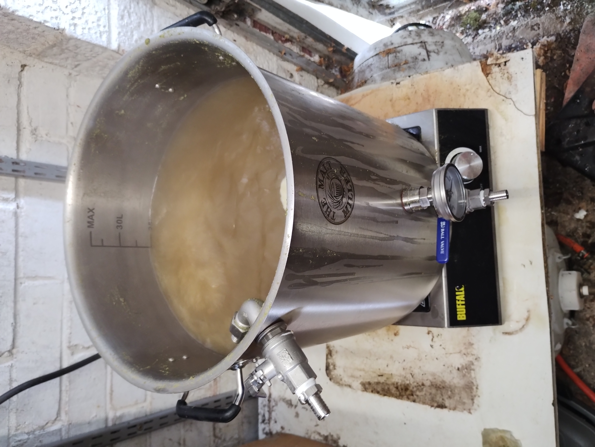

---
eleventyNavigation:
  key: "About"
  order: 3
---
# About the brewey

I am a keen amateur brewer - and I'm a member of the [Reading Amateur Brewers](https://readingamateurbrewers.co.uk/), so if you're in the Reading area and you're interested in 
brewing, check out the socials for an event, and come along, say hello, and drink some home-brewed beers!

I started brewing all the way back in 2010 with kit brews, and I
still have fond memories of the Coopers Stout kit (though it would be interesting to 
see what I thought if I were to brew it today!)

After kits I bought a simple boiler, which was just a plastic bucket with a kettle
element fitted, and started doing extract brews.

Inevitably this led to more, and at the end of 2010 I bought a coolbox mash tun from [The Malt Miller](https://www.themaltmiller.co.uk/), which can't have been long after they opened (and I'm very happy to still be using them to this day).

This gave me the ability to do all grain brewing (maybe I did some brew-in-a-bag back then? I can't actually remember!), and that's been my focus ever since.

A bit later I wanted to move to a proper 3-vessel system, so I slightly (!) over-bought 
and got a 70 litre stockpot and gas burner, which is the system I've been brewing on until very recently.

Fermentation has been controlled since my switch to extract brews thanks to a second-hand fridge, with a temperature controller. Heat was supplied at first by a light-bulb, then a tube heater, then a heat pad, and finally by heat belts.

In March 2022 I made the switch from fermenting in plastic buckets to shiny stainless, and I now have a SS Brewtech 7 Gallon (US!) Brewbucket, and a Malt Miller 30L Stainless Steel Conical Fermenter.

I've also reduced my boiler size from 70 litres to 35 litres.  My intention was that by buying big I could do some double-length batches.  I did one, to prove the point. So now I have dropped down to a sensible sized stainless pot, and also switched from burning gas to running an induction hob.  This move has had the added bonus of speeding up the brewday, as it definitely comes to the boil quicker, and I even seem to get more efficient cooling as well, mainly because my immersion cooler is actually fully immersed now...

